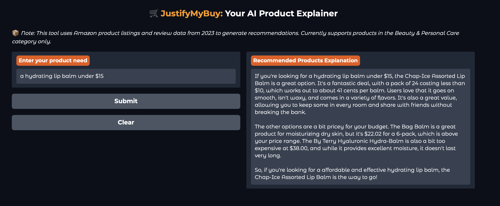

# 🛒 JustifyMyBuy: AI-Powered Product Explainer

> A semantic search + LLM explainer for Amazon product recommendations.

**JustifyMyBuy** is an AI-powered system that doesn’t just recommend products — it explains *why* they’re a good fit.

---

## 🚀 Live Demo

🔗 Try it yourself: [JustifyMyBuy: Your AI Product Explainer](https://huggingface.co/spaces/kmraastha/Justifymybuy)

---

It uses Retrieval-Augmented Generation (RAG) to retrieve relevant Amazon products and generate natural-language justifications based on their metadata and reviews. The app runs on Python, uses FAISS for vector search, Meta LLaMA-3 via Together API for reasoning, and Gradio for a polished user interface.

---

📚 Dataset Source  
This project uses product metadata and reviews from the [Amazon Reviews 2023 Dataset](https://amazon-reviews-2023.github.io), released for research and educational purposes.  
🔹 Only a filtered subset of the *Beauty & Personal Care* category was used due to file size constraints.

---

## 📸 Example Output

> **Query:** _“a hydrating lip balm under $15”_

  

The tool selects a top match, justifies it based on value and user reviews, and even explains why others didn’t fit — all in friendly, readable language.

---

## ✅ Key Features

- Accepts free-text product needs (e.g., “shampoo for dry scalp under $30”)
- Retrieves top matches using `SentenceTransformer` + `FAISS`
- Builds structured RAG prompts with titles, features, and real reviews
- Generates justifications using Meta’s `LLaMA-3` via Together API
- Interactive Gradio UI styled like Amazon’s interface

---

## 📁 Files

| File / Folder                         | Description                                                                   |
| ------------------------------------- | ----------------------------------------------------------------------------- |
| `justifymybuy.ipynb`                  | Main notebook: processes data, builds embeddings, and launches the Gradio app |
| `meta_Beauty_and_Personal_Care.jsonl` | Amazon product metadata (original file from the dataset source)               |
| `Beauty_and_Personal_Care.jsonl`      | Amazon product reviews (original file from the dataset source)                |
| `vector_store/`                       | FAISS index and product embeddings (generated at runtime; not stored)         |

---

## 🧠 Future Work

- Expand to more categories beyond Beauty & Personal Care
- Add filters (brand, price, rating) to UI
- Replace FAISS with hybrid retriever (BM25 + dense)
- Deploy to Hugging Face or Streamlit Cloud
- Rerank retrieved products using cross-encoder

---

## 📜 License

This project is shared for demonstration purposes only. Please do not reuse or deploy commercially without permission.

---

